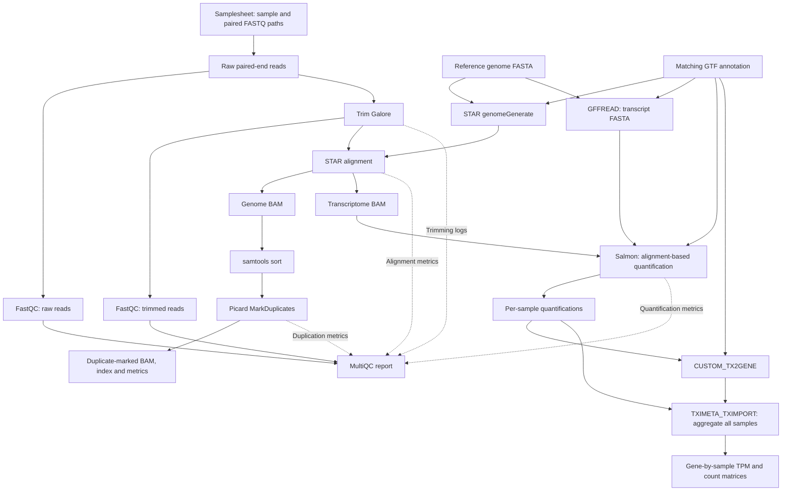

# computational-workflows/rnaseq

[](https://github.com/codespaces/new/wanchenzhang/rnaseq)
[](https://www.nextflow.io/)
[](https://github.com/nf-core/tools/releases/tag/4.1.0)
[](https://www.docker.com/)

## Introduction

**computational-workflows/rnaseq** is a bioinformatics pipeline for processing paired-end RNA-sequencing data. It performs quality control, adapter trimming, STAR alignment, duplicate marking and Salmon quantification, and produces a gene-by-sample TPM matrix. The pipeline was developed for the Computational Workflows course using the nf-core template and reusable nf-core modules, with Docker containers and Nextflow execution reports to support reproducibility.

Repository: [wanchenzhang/rnaseq](https://github.com/wanchenzhang/rnaseq).

This is a custom course pipeline built with nf-core components; it is not the official nf-core/rnaseq pipeline. Docker has been tested locally. CI, linting, alternative execution profiles and a Zenodo release have not been verified for this documentation.

### Pipeline steps

1. Validate the samplesheet and create sample input channels.
2. Assess raw-read quality with **FastQC**.
3. Trim adapters and low-quality read ends with **Trim Galore**.
4. Assess trimmed-read quality with **FastQC**.
5. Build a reference index with **STAR genomeGenerate** and extract transcript sequences with **GFFREAD**.
6. Align trimmed reads to the reference with **STAR**, producing genome and transcriptome BAM files.
7. Sort genome alignments with **samtools sort** and mark duplicates with **Picard MarkDuplicates**.
8. Quantify transcriptome alignments with **Salmon**.
9. Generate a transcript-to-gene mapping with **CUSTOM_TX2GENE** and aggregate all samples with **TXIMETA_TXIMPORT**.
10. Combine available quality-control metrics in **MultiQC** and save software versions and execution records.

### Workflow map




Solid arrows show data flow. Dashed arrows show metrics or logs supplied to MultiQC; whether a section appears depends on parser support and the available files.

**Duplicate marking and expression quantification are separate branches.** Picard marks duplicates in the genome BAM and retains them (`REMOVE_DUPLICATES=false`). Salmon uses STAR's transcriptome BAM, not the duplicate-marked genome BAM. Duplicate marking therefore does not alter the current TPM calculation.

## Usage

> [!NOTE]
> If you are new to Nextflow and nf-core, consult the [environment setup guide](https://nf-co.re/docs/get_started/environment_setup/overview). Start with the `test,docker` profile below to validate your environment before using your own data.

### Requirements

- Nextflow **>=25.10.4** and a compatible Java installation.
- Git to obtain the repository.
- A working Docker installation accessible from the terminal running Nextflow.
- Linux, or Windows with WSL2 and Docker integration enabled.
- Internet access for public test inputs, Nextflow plugins and container downloads.
- Sufficient disk space for downloaded inputs, task files and published outputs.

Docker is the execution profile validated for this project. Other profiles inherited from the template have not been validated here.

The test profile limits each task to at most **4 CPUs, 4 GB RAM and one hour**, with at most two local tasks running concurrently. These are per-task limits, not a 4 GB limit for the entire run. Allow additional memory for Nextflow, Docker and the operating system.

### Quick start: complete integration test

```bash
git clone https://github.com/wanchenzhang/rnaseq.git
cd rnaseq

nextflow run . -profile test,docker --outdir results_test
```

The test profile provides the samplesheet, FASTA and GTF automatically. No personal filesystem paths or separately prepared local reference files are required. Run the first validation without `-resume`.

#### Test dataset

The test uses three paired-end Saccharomyces cerevisiae subsets from GSE110004, distributed by nf-core/test-datasets:

| Sample | Run accession | Input read pairs |
|---|---|---:|
| WT_REP1 | SRR6357070 | 50,000 |
| WT_REP2 | SRR6357072 | 50,000 |
| RAP1_IAA_30M_REP1 | SRR6357076 | 50,000 |

FASTQ URLs in `assets/samplesheet_test.csv` are pinned to test-datasets commit `cad884e7fbe5617dcd55bdd07d9ddf65b54febe4`.

The reference FASTA and GTF are the Ensembl R64-1-1 yeast reference distributed through iGenomes:

- [Genome FASTA](https://ngi-igenomes.s3.amazonaws.com/igenomes/Saccharomyces_cerevisiae/Ensembl/R64-1-1/Sequence/WholeGenomeFasta/genome.fa)
- [Annotation GTF](https://ngi-igenomes.s3.amazonaws.com/igenomes/Saccharomyces_cerevisiae/Ensembl/R64-1-1/Annotation/Genes/genes.gtf)

These reference URLs are public but are not content-pinned. Preserve reference checksums when preparing a frozen release. The iGenomes annotation differs from the Ensembl release 110 annotation used in earlier local yeast runs.

The subsets are intended to verify pipeline execution and multiple-sample aggregation. They are not sufficient evidence for biological conclusions about treatment effects.

#### Observed validation

A local Docker test completed successfully on **6 October 2026**:

- 26 tasks completed across the full workflow.
- All three samples produced duplicate-marked BAM files, indexes and metrics.
- The merged gene TPM matrix contained 7,126 genes and the three expected sample columns.
- Each sample's gene TPM sum was 1,000,000.00 at the reported precision.
- MultiQC, software-version records and Nextflow execution reports were generated.

This is evidence from the observed integration run, not a claim that automated CI tests have passed. The gene count is specific to this reference, annotation and aggregation setup.

### Running your own paired-end samples

#### 1. Prepare a samplesheet

Create a comma-separated file with this header:

```csv
sample,fastq_1,fastq_2
SAMPLE_A,/absolute/path/SAMPLE_A_1.fastq.gz,/absolute/path/SAMPLE_A_2.fastq.gz
SAMPLE_B,/absolute/path/SAMPLE_B_1.fastq.gz,/absolute/path/SAMPLE_B_2.fastq.gz
```

Each row represents one sample and its matched R1/R2 FASTQ pair. Use unique sample names without spaces. FASTQ filenames must end in `.fastq.gz` or `.fq.gz`. Public HTTPS URLs can also be used, as demonstrated by the test samplesheet.

For local data, absolute paths avoid ambiguity about the launch directory. Keep the matching R1 and R2 files together in the same row. Single-end inputs and multiple lanes per sample have not been validated for this project.

#### 2. Provide matching references

Use an uncompressed genome FASTA (`.fa` or `.fasta`) and GTF (`.gtf`) from the same species and genome assembly, with compatible chromosome names. These formats are used by the validated configuration.

#### 3. Check resource and indexing settings

Inspect `conf/modules.config` before running another organism. It currently includes a yeast-oriented STAR `--genomeSAindexNbases 10` setting and `--sjdbOverhang 149`. The test profile overrides the overhang to 100 for its 101 bp reads. Set the overhang according to the intended read length and choose a suitable index setting for your genome.

The current non-test STAR resource requests are 8 CPUs and 20 GB RAM. These requests are not a guarantee that a larger genome will fit: review resource requirements for the chosen reference and available machine memory.

#### 4. Run the pipeline

```bash
nextflow run . \
    -profile docker \
    --input samplesheet.csv \
    --fasta /absolute/path/reference.fa \
    --gtf /absolute/path/annotation.gtf \
    --outdir results
```

Do not add the `test` profile for your own dataset unless you intentionally want its reference and resource settings.

| Parameter | Purpose |
|---|---|
| `--input` | Samplesheet CSV |
| `--fasta` | Reference genome FASTA |
| `--gtf` | Matching gene annotation GTF |
| `--outdir` | Published output directory |
| `--multiqc_title` | Optional MultiQC report title |
| `-profile docker` | Container execution profile |
| `-resume` | Reuse eligible cached tasks from an earlier run |

To inspect the pipeline's available options:

```bash
nextflow run . --help
```

### Outputs

Paths below are relative to the selected output directory:

| Directory | Contents |
|---|---|
| `fastqc/` | Raw-read FastQC HTML and ZIP reports |
| `trimgalore/` | Trimmed FASTQ files and available trimming reports |
| `fastqc_after/` | FastQC reports for trimmed reads |
| `reference/star/` | Generated STAR genome index |
| `reference/transcripts/` | Transcript FASTA generated by GFFREAD |
| `star/` | STAR alignment files and logs, including transcriptome BAM |
| `samtools_sort/` | Coordinate-sorted genome BAM files |
| `markduplicates/` | Duplicate-marked BAM files, indexes and Picard metrics |
| `salmon/<sample>/` | Per-sample Salmon quantification outputs |
| `tximport/` | Transcript-to-gene mapping and merged abundance matrices |
| `multiqc/` | `multiqc_report.html` and supporting report data |
| `pipeline_info/` | Execution report, trace, timeline, workflow DAG, parameters and software versions |

#### Gene TPM matrix

The main expression output is:

```text
tximport/salmon_merged.gene_tpm.tsv
```

It is a tab-separated table with one row per gene:

```text
gene_id    gene_name    RAP1_IAA_30M_REP1    WT_REP1    WT_REP2
```

Sample columns are assembled in sample-ID order. Gene names can be missing where the reference does not provide them. Zero TPM indicates no estimated abundance for that gene in the corresponding sample; it does not by itself establish biological absence.

Additional outputs include gene counts, scaled count matrices, gene lengths, transcript TPM and transcript counts. Salmon-derived counts are estimated abundances, not necessarily integer read counts. TPM describes relative abundance; this pipeline does not perform differential-expression testing.

### Checking a completed test

```bash
head -n 5 results_test/tximport/salmon_merged.gene_tpm.tsv
ls -lh results_test/markduplicates/
ls -lh results_test/multiqc/multiqc_report.html
ls -lh results_test/pipeline_info/
```

Confirm that the matrix has the three expected sample columns and that each sample has a marked BAM, index and metrics file. Open the MultiQC report to inspect quality metrics rather than relying solely on task completion.

For this three-sample dataset, check gene counts and TPM sums with:

```bash
awk -F '\t' '
NR == 1 {
    ncols = NF
    for (i = 3; i <= ncols; i++) names[i] = $i
    next
}
{
    for (i = 3; i <= ncols; i++) sums[i] += $i
}
END {
    print "Genes:", NR - 1
    for (i = 3; i <= ncols; i++)
        printf "%s: %.2f\n", names[i], sums[i]
}' results_test/tximport/salmon_merged.gene_tpm.tsv
```

The observed test sums were approximately one million per sample. This check alone does not establish complete transcript-to-gene mapping or biological validity.

### Interpreting quality-control results

- FastQC warnings and failures are diagnostic flags. RNA-seq can show biased initial base composition and high sequence duplication even when per-base quality is good.
- FastQC sequence duplication and Picard alignment-based duplication use different methods and input populations. Their percentages are not a before-and-after deduplication comparison.
- STAR and Salmon percentages have different denominators in this workflow. Salmon receives transcriptome alignments already generated by STAR; a high Salmon percentage does not imply the same percentage of original FASTQ pairs was quantified.
- MultiQC tables may display `0.0 M` for small counts because `M` means millions and the table rounds values. Use detailed data or original logs to recover actual counts.
- Available trimming logs are supplied to MultiQC, but the observed report did not contain a separate Trim Galore statistics section. Compare raw and trimmed FastQC reports and inspect trimming logs directly.

### Resuming and measuring runtime

Resume a previous test using the same working directory:

```bash
nextflow run . -profile test,docker --outdir results_test -resume
```

Keep the `work/` directory and Nextflow cache metadata if you want to resume. A resumed run measures reuse of eligible tasks, not execution of every step from scratch.

For a fresh timing measurement on Linux or WSL, omit `-resume`:

```bash
/usr/bin/time -p -o runtime_test.txt \
    nextflow run . -profile test,docker --outdir results_test_timed
```

`real` records elapsed wall-clock time. Downloads and container preparation can affect this measurement. Use the corresponding timestamped Nextflow execution report, trace and timeline for task-level timing and resource information. Shell `user` and `sys` timing should not be treated as the total CPU time of all container tasks.

### Troubleshooting

| Problem | What to check |
|---|---|
| Config parsing error such as `Unexpected input: <EOF>` | Balanced braces and quotes in the configuration named by the error |
| Requested memory exceeds available memory | Task requests, profile overrides, and memory available to WSL/Docker |
| Exit status 137 | Possible operating-system or container memory kill; confirm using system/container logs |
| Missing input or reference | Samplesheet entries, local paths, public URL availability and matching FASTA/GTF |
| STAR reports many reads mapped to too many loci | Repetitive sequence content and alignment filtering; investigate before changing thresholds |
| An expected MultiQC section is absent | Published logs, files supplied to MultiQC and parser compatibility |
| Several execution reports exist | Match report/trace timestamps to the run being assessed |

Start with `.nextflow.log`. For failed tasks, inspect `.command.sh`, `.command.err` and `.command.log` in the work directory reported by Nextflow.

### Project structure

```text
main.nf                  Pipeline entry point
nextflow.config          Parameters, execution profiles and reporting
nextflow_schema.json     Parameter validation
workflows/rnaseq.nf      Connections between analysis modules
conf/modules.config     Module options, resources and publishing paths
conf/test.config        Public three-sample yeast test profile
assets/schema_input.json
                        Samplesheet validation
assets/samplesheet_test.csv
                        Public test FASTQ URLs
modules/nf-core/        Reused tool modules
subworkflows/           Initialisation, completion and utility workflows
```

Keep source code, configuration, documentation and the test samplesheet in Git. Generated outputs, downloaded data, task directories and credentials should not be committed.


> [!NOTE]
> Supply analysis parameters using the command line or Nextflow `-params-file`. The built-in test profile supplies its own test parameters. Use `-c` configuration files for execution settings such as process resources; see the [nf-core parameter guidance](https://nf-co.re/docs/running/run-pipelines#using-parameter-files).

## Credits

computational-workflows/rnaseq was developed by **Wanchen Zhang and Kritika Manna** for the Computational Workflows course.

We acknowledge the nf-core community for the template, reusable modules and public test datasets, and the developers of the tools integrated into this workflow.


## Citations

Tool-specific references are listed in [CITATIONS.md](CITATIONS.md). When describing this pipeline, cite the tools and versions actually used; software-version records are saved under `pipeline_info/`.

| Component | Resource |
|---|---|
| Nextflow | [Nextflow](https://www.nextflow.io/) |
| FastQC | [FastQC](https://www.bioinformatics.babraham.ac.uk/projects/fastqc/) |
| Trim Galore | [Trim Galore](https://github.com/FelixKrueger/TrimGalore) |
| STAR | [STAR](https://github.com/alexdobin/STAR) |
| GFFREAD | [GFFREAD](https://github.com/gpertea/gffread) |
| samtools | [samtools](https://www.htslib.org/) |
| Picard | [Picard](https://broadinstitute.github.io/picard/) |
| Salmon | [Salmon](https://combine-lab.github.io/salmon/) |
| tximport / tximeta | [tximport](https://bioconductor.org/packages/tximport/), [tximeta](https://bioconductor.org/packages/tximeta/) |
| MultiQC | [MultiQC](https://multiqc.info/) |
| Test reads | [Pinned nf-core test dataset](https://github.com/nf-core/test-datasets/tree/cad884e7fbe5617dcd55bdd07d9ddf65b54febe4/testdata/GSE110004), [GSE110004](https://www.ncbi.nlm.nih.gov/geo/query/acc.cgi?acc=GSE110004) |

This pipeline uses code and infrastructure developed and maintained by the [nf-core](https://nf-co.re) community, reused under the MIT license.

> **The nf-core framework for community-curated bioinformatics pipelines.**
>
> Philip Ewels, Alexander Peltzer, Sven Fillinger, Harshil Patel, Johannes Alneberg, Andreas Wilm, Maxime Ulysse Garcia, Paolo Di Tommaso & Sven Nahnsen.
>
> *Nature Biotechnology* (2020). doi: [10.1038/s41587-020-0439-x](https://doi.org/10.1038/s41587-020-0439-x).

The project is licensed under the [MIT License](LICENSE). No project Zenodo DOI is currently documented.
