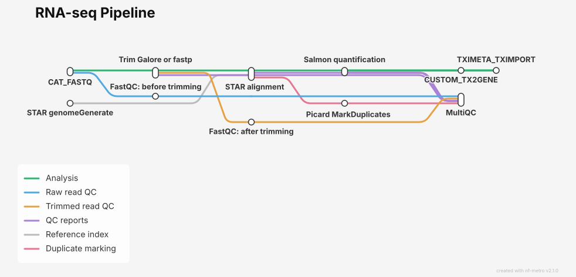

# computational-workflows/rnaseq

[](https://github.com/codespaces/new/wanchenzhang/rnaseq)
[](https://www.nextflow.io/)
[](https://github.com/nf-core/tools/releases/tag/4.1.0)
[](https://www.docker.com/)

## Introduction

**computational-workflows/rnaseq** is a bioinformatics pipeline for processing single-end and paired-end RNA-sequencing data. It performs quality control, adapter trimming, STAR alignment, duplicate marking and Salmon quantification, and produces a gene-by-sample TPM matrix. The pipeline was developed for the Computational Workflows course using the nf-core template and reusable nf-core modules, with Docker containers and Nextflow execution reports to support reproducibility.

Repository: [wanchenzhang/rnaseq](https://github.com/wanchenzhang/rnaseq).


### Pipeline steps

1. Validate the samplesheet and group sequencing runs by sample.
2. Merge FASTQ files from the same sample with **CAT_FASTQ**, keeping paired-end R1 and R2 files separate.
3. Assess input-read quality with **FastQC**.
4. Trim adapters and filter reads with **Trim Galore** (default) or **fastp** (`--trimmer fastp`).
5. Assess trimmed-read quality with **FastQC**.
6. Build a reference index with **STAR genomeGenerate**. Use the supplied `--transcript_fasta`, or generate transcript sequences with **GFFREAD** when it is not supplied.
7. Align trimmed reads with **STAR**, producing a coordinate-sorted genome BAM and a transcriptome BAM.
8. Mark duplicates in the coordinate-sorted genome BAM with **Picard MarkDuplicates**.
9. Quantify transcriptome alignments with **Salmon**.
10. Generate a transcript-to-gene mapping with **CUSTOM_TX2GENE**, aggregate samples with **TXIMETA_TXIMPORT**, and collect available QC metrics with **MultiQC**.

### Workflow map



## Usage

> [!NOTE]
> If you are new to Nextflow and nf-core, consult the [environment setup guide](https://nf-co.re/docs/get_started/environment_setup/overview). Start with the `test,docker` profile below to validate your environment before using your own data.

### Requirements

- Nextflow **>=25.10.4** and a compatible Java installation.
- Git to obtain the repository.
- A working Docker installation accessible from the terminal running Nextflow.
- Linux, or Windows with WSL2 and Docker integration enabled.
- Internet access for public test inputs, Nextflow plugins and container downloads.
- Sufficient disk space for downloaded inputs, task files and published outputs.

Docker is the container execution profile tested for this project. Other profiles inherited from the template have not been validated here.

The test profile limits each task to at most **4 CPUs, 4 GB RAM and one hour**. These are per-task limits, not a 4 GB limit for the entire run; simultaneous tasks can use more memory. Allow additional memory for Nextflow, Docker and the operating system.

### Quick start: complete integration test

```bash
git clone https://github.com/wanchenzhang/rnaseq.git
cd rnaseq

nextflow run . -profile test,docker --outdir results_test
```

The test profile provides a public samplesheet, genome FASTA, GTF and transcript FASTA automatically. Since the transcript FASTA is supplied, the default test skips GFFREAD. No personal filesystem paths or separately prepared local reference files are required. Run the first validation without `-resume`.

#### Test dataset

The current `conf/test.config` uses the RNA-seq test files from [nf-core/test-datasets](https://github.com/nf-core/test-datasets/tree/rnaseq):

- [Samplesheet](https://raw.githubusercontent.com/nf-core/test-datasets/rnaseq/samplesheet/v3.10/samplesheet_test.csv)
- [Genome FASTA](https://raw.githubusercontent.com/nf-core/test-datasets/rnaseq/reference/genome.fasta)
- [GTF annotation](https://raw.githubusercontent.com/nf-core/test-datasets/rnaseq/reference/genes.gtf)
- [Transcript FASTA](https://raw.githubusercontent.com/nf-core/test-datasets/rnaseq/reference/transcriptome.fasta)

The samplesheet contains yeast RNA-seq subsets from GSE110004, including single-end inputs and multiple sequencing runs for some samples:

| Sample | Runs | Input type |
|---|---|---|
| WT_REP1 | SRR6357070, SRR6357071 | Paired-end; two runs |
| WT_REP2 | SRR6357072 | Paired-end; one run |
| RAP1_UNINDUCED_REP1 | SRR6357073 | Single-end; one run |
| RAP1_UNINDUCED_REP2 | SRR6357074, SRR6357075 | Single-end; two runs |
| RAP1_IAA_30M_REP1 | SRR6357076 | Paired-end; one run |

Seven samplesheet rows are grouped into five samples. CAT_FASTQ concatenates all R1 files and all R2 files separately for paired-end samples, or all reads for single-end samples. The samplesheet's `strandedness` column is not used by this implementation; Salmon currently infers library type using `--libType A`.

These URLs follow the repository's `rnaseq` branch and can change. The small reference files and read subsets are for workflow testing, not a complete biological analysis.

#### Validation status

The official five-sample test has completed with Trim Galore and with fastp using the `fastp_optional` profile. The latter enables polyX trimming and paired-end overlap correction. Both runs produced STAR alignment logs and MultiQC reports for all five samples.

Compared with the five-sample Trim Galore run using the same test samplesheet and reference URLs, fastp with these optional features slightly increased unique mapping percentages and reduced mismatch rates, but retained fewer uniquely mapped reads. This is a small workflow test, not evidence that either tool is universally better. The earlier three-sample benchmark used a different reference setup and should not be compared directly with these mapping percentages.

Check the current TPM matrix and key output files as described below. The older output-validation script does not yet cover the mixed single-end, paired-end and multi-run test inputs.

### Running your own samples

#### 1. Prepare a samplesheet

Create a comma-separated file with this header:

```csv
sample,fastq_1,fastq_2
SAMPLE_A,/absolute/path/SAMPLE_A_1.fastq.gz,/absolute/path/SAMPLE_A_2.fastq.gz
SAMPLE_B,/absolute/path/SAMPLE_B_1.fastq.gz,/absolute/path/SAMPLE_B_2.fastq.gz
```

Each row represents one sequencing run. Supply R1 and R2 for paired-end runs; leave `fastq_2` empty for single-end runs. Use sample names without spaces. Repeat the same sample name for multiple runs of that sample; they will be merged before trimming. Different biological samples must have different names. Do not mix single-end and paired-end runs under one sample name. FASTQ filenames must end in `.fastq.gz` or `.fq.gz`. Public HTTPS URLs can also be used, as demonstrated by the test samplesheet.

For local data, absolute paths avoid ambiguity about the launch directory. Keep matching R1 and R2 files together in the same row. A single-end row can be written as `SAMPLE_C,/absolute/path/SAMPLE_C.fastq.gz,`. The current workflow includes single-end and multi-run input handling; verify these paths with the current test before using larger datasets.

#### 2. Provide matching references

Provide an uncompressed genome FASTA (`.fa` or `.fasta`) and GTF (`.gtf`) from the same species and genome assembly, with compatible chromosome names.

A transcript FASTA is optional:

- Without `--transcript_fasta`, GFFREAD extracts spliced transcript sequences from the genome FASTA and GTF.
- With `--transcript_fasta`, the supplied file is passed to Salmon and GFFREAD is skipped.

The supplied transcript FASTA must use transcript IDs and sequences compatible with STAR's transcriptome alignments and the GTF. It must contain transcript sequences, not whole chromosome sequences. Genome FASTA and GTF are still required for STAR even when transcript FASTA is supplied.

#### 3. Check resource and indexing settings

Inspect `conf/modules.config` before running another organism. It currently includes a yeast-oriented STAR `--genomeSAindexNbases 10` setting and `--sjdbOverhang 149`. The public test reads are 101 bp long; an overhang of 100 would match that read length, but the current test config does not override the module setting. Set the overhang according to the intended read length and choose a suitable index setting for your genome.

The current non-test STAR resource requests are 8 CPUs and 20 GB RAM. STAR uses `--outSAMtype BAM SortedByCoordinate` for internal sorting and `--quantMode TranscriptomeSAM` for the BAM used by Salmon. The configured `--limitBAMsortRAM 1000000000` allows approximately 1 GB for sorting; it is not the total STAR memory limit. Review both task memory and sorting memory when using larger datasets or another organism.

#### 4. Run the pipeline

```bash
nextflow run . \
    -profile docker \
    --input samplesheet.csv \
    --fasta /absolute/path/reference.fa \
    --gtf /absolute/path/annotation.gtf \
    --outdir results
```

To use an existing matching transcript FASTA, add the optional parameter:

```bash
nextflow run . \
    -profile docker \
    --input samplesheet.csv \
    --fasta /absolute/path/reference.fa \
    --gtf /absolute/path/annotation.gtf \
    --transcript_fasta /absolute/path/transcripts.fasta \
    --outdir results_provided_transcripts
```

Do not add the `test` profile for your own dataset unless you intentionally want its reference and resource settings.

#### 5. Choose a trimming tool

Trim Galore is the default. To select fastp, add `--trimmer fastp`:

```bash
nextflow run . \
    -profile test,docker \
    --trimmer fastp \
    --outdir results_test_fastp
```

Both tools receive the reads merged by CAT_FASTQ. Their trimmed reads are passed to the same independent FastQC step and downstream STAR/Salmon workflow. Fastp's own HTML and JSON reports are additional QC outputs; fastp does not run FastQC. The Trim Galore configuration does not enable `--fastqc`, so the separate post-trimming FastQC step is also required for that branch.

#### Optional fastp features

The `fastp_optional` profile selects fastp and enables polyX tail trimming and base correction in overlapping paired-end reads:

```bash
nextflow run . \
    -profile test,docker,fastp_optional \
    --outdir results_test_fastp_optional
```

For your own data, use `-profile docker,fastp_optional` together with your samplesheet and reference parameters. Add `-resume` to reuse eligible cached tasks when continuing a run.

| Parameter | Default | Effect when using fastp |
|---|---|---|
| `fastp_trim_poly_x` | `false` | Enable polyX tail trimming, including polyA |
| `fastp_poly_g` | `'auto'` | `auto`: leave fastp's automatic detection unchanged; `on`: force polyG trimming; `off`: disable it |
| `fastp_correction` | `false` | Enable base correction in overlapping paired-end reads; not applicable to single-end reads |

For example, add `--fastp_poly_g on` or `--fastp_poly_g off` to control polyG trimming. To customize the Boolean options, edit or add a profile inside `profiles {}` in `nextflow.config`, using unquoted `true` or `false`. In the tested environment, bare command-line Boolean switches were received as strings and rejected by parameter validation; the `fastp_optional` profile avoids that issue.

These options affect only fastp. PolyX trimming and correction are optional and should be chosen according to the library and QC results. UMI processing and merging overlapping paired-end reads are not enabled by this interface; the downstream workflow does not implement UMI-aware counting or a merged-read branch.

| Parameter | Purpose |
|---|---|
| `--trimmer` | `trimgalore` (default) or `fastp` |
| `--input` | Samplesheet CSV |
| `--fasta` | Reference genome FASTA |
| `--gtf` | Matching gene annotation GTF |
| `--transcript_fasta` | Optional matching transcript FASTA; skips GFFREAD when supplied |
| `--outdir` | Published output directory |
| `--multiqc_title` | Optional MultiQC report title |
| `-profile docker` | Container execution profile |
| `-profile docker,fastp_optional` | Docker execution with fastp, polyX trimming and paired-end correction |
| `-resume` | Reuse eligible cached tasks from an earlier run |

To inspect the pipeline's available options:

```bash
nextflow run . --help
```
### Outputs

Paths below are relative to the selected output directory:

| Directory | Contents |
|---|---|
| `fastqc/` | Raw-read FastQC HTML and ZIP reports |
| `cat/` | FASTQ files merged by sample using CAT_FASTQ |
| `trimgalore/` | Trimmed FASTQ files and available trimming reports when Trim Galore is selected |
| `fastp/` | Trimmed FASTQ files, fastp HTML/JSON QC reports and logs when fastp is selected |
| `fastqc_after/` | FastQC reports for trimmed reads |
| `reference/star/` | Generated STAR genome index |
| `reference/transcripts/` | Generated transcript FASTA; produced only when GFFREAD runs |
| `star/` | Coordinate-sorted genome BAM (`*.Aligned.sortedByCoord.out.bam`), transcriptome BAM and STAR logs |
| `markduplicates/` | Duplicate-marked BAM files, indexes and Picard metrics |
| `salmon/<sample>/` | Per-sample Salmon quantification outputs |
| `tximport/` | Transcript-to-gene mapping and merged abundance matrices |
| `multiqc/` | `multiqc_report.html` and supporting report data |
| `pipeline_info/` | Execution report, trace, timeline, workflow DAG, parameters and software versions |

#### Gene TPM matrix

The main expression output is:

```text
tximport/salmon_merged.gene_tpm.tsv
```

It is a tab-separated table with one row per gene:

```text
gene_id    gene_name    SAMPLE_A    SAMPLE_B
```

Sample columns are assembled in sample-ID order. Gene names can be missing where the reference does not provide them. Zero TPM indicates no estimated abundance for that gene in the corresponding sample; it does not by itself establish biological absence.

Additional outputs include gene counts, scaled count matrices, gene lengths, transcript TPM and transcript counts. Salmon-derived counts are estimated abundances, not necessarily integer read counts. TPM describes relative abundance; this pipeline does not perform differential-expression testing.

### Checking a completed test

```bash
head -n 5 results_test/tximport/salmon_merged.gene_tpm.tsv
ls -lh results_test/markduplicates/
ls -lh results_test/multiqc/multiqc_report.html
ls -lh results_test/pipeline_info/
```

For the current official samplesheet, confirm that the TPM matrix contains the five sample columns listed above. Check that each sample has a duplicate-marked BAM, index, Picard metrics and Salmon `quant.sf`. Also inspect FastQC and MultiQC, since successful task completion does not establish data quality.

Check gene counts and TPM sums with:

```bash
awk -F '\t' '
NR == 1 {
    ncols = NF
    for (i = 3; i <= ncols; i++) names[i] = $i
    next
}
{
    for (i = 3; i <= ncols; i++) sums[i] += $i
}
END {
    print "Genes:", NR - 1
    for (i = 3; i <= ncols; i++)
        printf "%s: %.2f\n", names[i], sums[i]
}' results_test/tximport/salmon_merged.gene_tpm.tsv
```

TPM sums are a normalization check; they do not establish complete transcript-to-gene mapping or biological validity.

#### Output validation script

`bin/validate_outputs.py` was written for the earlier one-row-per-sample paired-end dataset. It checks TPM structure and values, paired FASTQ records and read IDs, and non-empty key output files. BAM checks cover existence and size, not internal format integrity.

The script still needs updating for the current single-end inputs, repeated sample IDs and CAT_FASTQ-derived output names. Do not use the earlier 21-pass result as evidence that the current five-sample test passed validation.

### Interpreting quality-control results

- FastQC warnings and failures are diagnostic flags. RNA-seq can show biased initial base composition and high sequence duplication even when per-base quality is good.
- FastQC sequence duplication and Picard alignment-based duplication use different methods and input populations. Their percentages are not a before-and-after deduplication comparison.
- STAR and Salmon percentages have different denominators in this workflow. Salmon receives transcriptome alignments already generated by STAR; a high Salmon percentage does not imply the same percentage of original FASTQ pairs was quantified.
- MultiQC tables may display `0.0 M` for small counts because `M` means millions and the table rounds values. Use detailed data or original logs to recover actual counts.
- Available trimming logs are supplied to MultiQC, but the observed report did not contain a separate Trim Galore statistics section. Compare raw and trimmed FastQC reports and inspect trimming logs directly.

### Resuming and measuring runtime

Resume a previous test using the same working directory:

```bash
nextflow run . -profile test,docker --outdir results_test -resume
```

Keep the `work/` directory and Nextflow cache metadata if you want to resume. A resumed run measures reuse of eligible tasks, not execution of every step from scratch.

For a fresh timing measurement on Linux or WSL, omit `-resume`:

```bash
/usr/bin/time -p -o runtime_test.txt \
    nextflow run . -profile test,docker --outdir results_test_timed
```

`real` records elapsed wall-clock time. Downloads and container preparation can affect this measurement. Use the corresponding timestamped Nextflow execution report, trace and timeline for task-level timing and resource information. Shell `user` and `sys` timing should not be treated as the total CPU time of all container tasks.

### Troubleshooting

| Problem | What to check |
|---|---|
| Config parsing error such as `Unexpected input: <EOF>` | Balanced braces and quotes in the configuration named by the error |
| Requested memory exceeds available memory | Task requests, profile overrides, and memory available to WSL/Docker |
| Exit status 137 | Possible operating-system or container memory kill; confirm using system/container logs |
| Missing input or reference | Samplesheet entries, local paths, public URL availability and matching FASTA/GTF |
| STAR reports many reads mapped to too many loci | Repetitive sequence content and alignment filtering; investigate before changing thresholds |
| An expected MultiQC section is absent | Published logs, files supplied to MultiQC and parser compatibility |
| Several execution reports exist | Match report/trace timestamps to the run being assessed |

Start with `.nextflow.log`. For failed tasks, inspect `.command.sh`, `.command.err` and `.command.log` in the work directory reported by Nextflow.

### Project structure

```text
main.nf                  Pipeline entry point
nextflow.config          Parameters, execution profiles and reporting
nextflow_schema.json     Parameter validation
workflows/rnaseq.nf      Connections between analysis modules
conf/modules.config     Module options, resources and publishing paths
conf/test.config        Public five-sample yeast test profile
assets/schema_input.json
                        Samplesheet validation
assets/samplesheet_test.csv
                        Earlier three-sample example (not the current test default)
bin/validate_outputs.py
                        Output validator for the earlier paired-end test
modules/nf-core/        Reused tool modules
subworkflows/           Initialisation, completion and utility workflows
```

Keep source code, configuration, documentation and the test samplesheet in Git. Generated outputs, downloaded data, task directories and credentials should not be committed.


> [!NOTE]
> Supply analysis parameters using the command line or Nextflow `-params-file`. The built-in test profile supplies its own test parameters. Use `-c` configuration files for execution settings such as process resources; see the [nf-core parameter guidance](https://nf-co.re/docs/running/run-pipelines#using-parameter-files).

## Credits

computational-workflows/rnaseq was developed by **Wanchen Zhang and Kritika Manna** for the Computational Workflows course.

We acknowledge the nf-core community for the template, reusable modules and public test datasets, and the developers of the tools integrated into this workflow.


## Citations

Tool-specific references are listed in [CITATIONS.md](CITATIONS.md). When describing this pipeline, cite the tools and versions actually used; software-version records are saved under `pipeline_info/`.

| Component | Resource |
|---|---|
| Nextflow | [Nextflow](https://www.nextflow.io/) |
| FastQC | [FastQC](https://www.bioinformatics.babraham.ac.uk/projects/fastqc/) |
| Trim Galore | [Trim Galore](https://github.com/FelixKrueger/TrimGalore) |
| fastp | [fastp](https://github.com/OpenGene/fastp) |
| STAR | [STAR](https://github.com/alexdobin/STAR) |
| GFFREAD | [GFFREAD](https://github.com/gpertea/gffread) |
| Picard | [Picard](https://broadinstitute.github.io/picard/) |
| Salmon | [Salmon](https://combine-lab.github.io/salmon/) |
| tximport / tximeta | [tximport](https://bioconductor.org/packages/tximport/), [tximeta](https://bioconductor.org/packages/tximeta/) |
| MultiQC | [MultiQC](https://multiqc.info/) |
| CAT_FASTQ | [nf-core cat/fastq module](https://github.com/nf-core/modules/tree/master/modules/nf-core/cat/fastq) |
| Test reads and references | [nf-core RNA-seq test datasets](https://github.com/nf-core/test-datasets/tree/rnaseq), [GSE110004](https://www.ncbi.nlm.nih.gov/geo/query/acc.cgi?acc=GSE110004) |

This pipeline uses code and infrastructure developed and maintained by the [nf-core](https://nf-co.re) community, reused under the MIT license.

> **The nf-core framework for community-curated bioinformatics pipelines.**
>
> Philip Ewels, Alexander Peltzer, Sven Fillinger, Harshil Patel, Johannes Alneberg, Andreas Wilm, Maxime Ulysse Garcia, Paolo Di Tommaso & Sven Nahnsen.
>
> *Nature Biotechnology* (2020). doi: [10.1038/s41587-020-0439-x](https://doi.org/10.1038/s41587-020-0439-x).

The project is licensed under the [MIT License](LICENSE).
